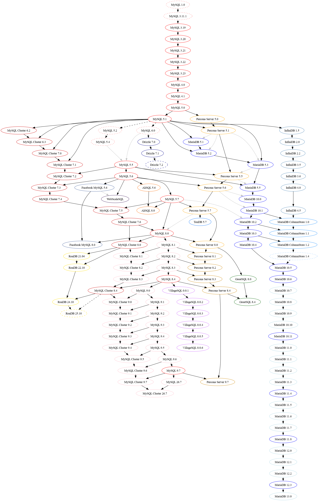

MySQL History Graph
===================

The MySQL family tree: MySQL itself and the servers forked or built from it,
from the first release in 1995 to today.

**Interactive timeline: https://percona-lab.github.io/mysql-history-graph/**

This repository started as a copy of
[dveeden/mysql-history-graph](https://github.com/dveeden/mysql-history-graph)
by Daniël van Eeden. It keeps his GraphViz graphs and adds the interactive
timeline.

Interactive timeline
--------------------

`index.html` has one lane per family and places each release by date.

- **Families:** MySQL, MySQL Cluster (NDB), RonDB, VillageSQL, Percona Server,
  Percona XtraDB Cluster, GreatSQL, TenDB, MariaDB, InfiniDB/ColumnStore,
  Facebook MySQL, WebScaleSQL, AliSQL and Drizzle.
- **Release details:** click a release to see its date, support status and
  notes, and to trace the releases it came from and led to.
- **Filters:** the Families menu toggles families on and off. Alt-click a
  family, or use its "only" button, to show just that one; "Show all" brings
  everything back. Clicking a family's name on the chart shows only that
  family, and clicking it again shows all. You can also zoom to a time range:
  all years, 1995–2005, 2005–2015, 2014–today, or the Innovation release era.
- **Events:** milestones such as the founding of MySQL AB and Percona, Sun
  buying MySQL AB, Oracle buying Sun, and the launch of the OurSQL Foundation.
- **Shareable links:** the selected release, time range and family filter
  are kept in the URL, so a link opens the same view.
- **Fits any screen:** the chart uses the full width of the window, from a
  phone up to a large monitor.

Some dates are approximate or inferred. The page marks each one and explains
why.

The page is a single file with no build step and no external requests. The
Poppins font is embedded in it. To run it locally:

    python3 -m http.server 8000

Then open http://localhost:8000/.

Logos: MySQL, MariaDB, Meta and Alibaba Cloud marks come from
[Simple Icons](https://simpleicons.org) (CC0). The Percona logomark (used for
Percona XtraDB Cluster and as the favicon) is from `percona/pdmysql-docs`.
`percona-server.svg` and `villagesql.svg` are vector redraws of the Percona
Server for MySQL and VillageSQL logos. Trademarks belong to their owners.
Families without a published mark get a monogram.

GraphViz graphs
---------------

| Source | Shows |
| --- | --- |
| `mysql-history-graph.dot` | MySQL and its forks, generated from `data/` |
| `mysql-only-history.dot` | MySQL releases only |
| `innodb-history-graph.dot` | InnoDB versions, from MySQL 5.1 to 5.6, and XtraDB |
| `mysql-bug.dot` | Life cycle of a MySQL bug report |

Rebuild the PNG and SVG files with GraphViz:

    make

`bug-tide/` holds Jupyter notebooks that chart open MySQL bugs per server
version, using data from bugs.mysql.com.

Contributing
------------

The lineage lives in `data/`, and both the timeline and the main GraphViz
graph are built from it:

| File | Holds |
| --- | --- |
| `data/vendors.json` | The families: name, lane colour, description, and the node colours used in the graph |
| `data/releases.json` | Every release: family, version, status, date, a flag for approximate dates, notes |
| `data/graph.json` | The lineage links (`derived`, `contribution`, `non-ga`) and their styles |
| `data/events.json` | The company events shown above the timeline |

If you add or correct a release, edit the JSON, then run `make`. That runs
`cmd/gendot` (Go) to rewrite `mysql-history-graph.dot` and fails on an unknown
family, status or release name, so typos are caught early. `index.html` fetches
the JSON, so to preview it locally serve the folder, for example with
`python3 -m http.server`. Opening the file directly will not load the data.
Pull requests are welcome, especially ones that replace an approximate date
with a sourced one.

Changes to `master` are published to GitHub Pages automatically.

The timeline was built and is kept up to date with an AI coding assistant.
`PROMPTS.md` has the prompts used and a reusable one for adding releases.

License
-------

BSD 3-Clause, see `LICENSE`. The embedded Poppins font is under the SIL Open
Font License, see `fonts/Poppins-OFL.txt`.

Related projects
----------------

* [dveeden/mysql-history-graph](https://github.com/dveeden/mysql-history-graph),
  the original. The JSON data format and `cmd/gendot` come from Daniël van
  Eeden's `json_data` branch.
* [RDBMS Timeline](https://github.com/rafaelma/rdbms-timeline)
